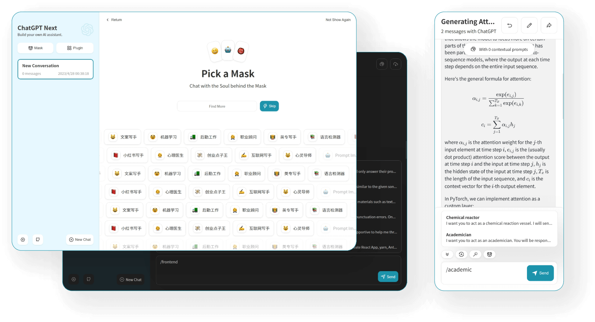

<h1 align="center">NextChat (ChatGPT Next Web)</h1>

One-Click to get a well-designed cross-platform ChatGPT web UI, with GPT3, GPT4 & Gemini Pro support.

[![Web][Web-image]][web-url]
[![Windows][Windows-image]][download-url]
[![MacOS][MacOS-image]][download-url]
[![Linux][Linux-image]][download-url]

[Web App](https://app.nextchat.dev/) / [Desktop App](https://github.com/Yidadaa/ChatGPT-Next-Web/releases) / [Discord](https://discord.gg/YCkeafCafC) / [Twitter](https://twitter.com/NextChatDev)

[web-url]: https://chatgpt.nextweb.fun
[download-url]: https://github.com/Yidadaa/ChatGPT-Next-Web/releases
[Web-image]: https://img.shields.io/badge/Web-PWA-orange?logo=microsoftedge
[Windows-image]: https://img.shields.io/badge/-Windows-blue?logo=windows
[MacOS-image]: https://img.shields.io/badge/-MacOS-black?logo=apple
[Linux-image]: https://img.shields.io/badge/-Linux-333?logo=ubuntu

## Features

- **Deploy for free with one-click** on Vercel in under 1 minute
- Compact client (~5MB) on Linux/Windows/MacOS, [download it now](https://github.com/Yidadaa/ChatGPT-Next-Web/releases)
- Fully compatible with self-deployed LLMs, recommended for use with [RWKV-Runner](https://github.com/josStorer/RWKV-Runner) or [LocalAI](https://github.com/go-skynet/LocalAI)
- Privacy first, all data is stored locally in the browser
- Markdown support: LaTex, mermaid, code highlight, etc.
- Responsive design, dark mode and PWA
- Fast first screen loading speed (~100kb), support streaming response
- New in v2: create, share and debug your chat tools with prompt templates (mask)
- Awesome prompts powered by [awesome-chatgpt-prompts-zh](https://github.com/PlexPt/awesome-chatgpt-prompts-zh) and [awesome-chatgpt-prompts](https://github.com/f/awesome-chatgpt-prompts)
- Automatically compresses chat history to support long conversations while also saving your tokens
- I18n: English, 简体中文, 繁体中文, 日本語, Français, Español, Italiano, Türkçe, Deutsch, Tiếng Việt, Русский, Čeština, 한국어, Indonesia

## Roadmap

- [x] System Prompt: pin a user defined prompt as system prompt [#138](https://github.com/Yidadaa/ChatGPT-Next-Web/issues/138)
- [x] User Prompt: user can edit and save custom prompts to prompt list
- [x] Prompt Template: create a new chat with pre-defined in-context prompts [#993](https://github.com/Yidadaa/ChatGPT-Next-Web/issues/993)
- [x] Share as image, share to ShareGPT [#1741](https://github.com/Yidadaa/ChatGPT-Next-Web/pull/1741)
- [x] Desktop App with tauri
- [x] Self-host Model: Fully compatible with [RWKV-Runner](https://github.com/josStorer/RWKV-Runner), as well as server deployment of [LocalAI](https://github.com/go-skynet/LocalAI): llama/gpt4all/rwkv/vicuna/koala/gpt4all-j/cerebras/falcon/dolly etc.
- [ ] Plugins: support network search, calculator, any other apis etc. [#165](https://github.com/Yidadaa/ChatGPT-Next-Web/issues/165)

## What's New

- 🚀 v2.10.1 support Google Gemini Pro model.
- 🚀 v2.9.11 you can use azure endpoint now.
- 🚀 v2.8 now we have a client that runs across all platforms!
- 🚀 v2.7 let's share conversations as image, or share to ShareGPT!
- 🚀 v2.0 is released, now you can create prompt templates, turn your ideas into reality! Read this: [ChatGPT Prompt Engineering Tips: Zero, One and Few Shot Prompting](https://www.allabtai.com/prompt-engineering-tips-zero-one-and-few-shot-prompting/).

## LICENSE

[MIT](https://opensource.org/license/mit/)
